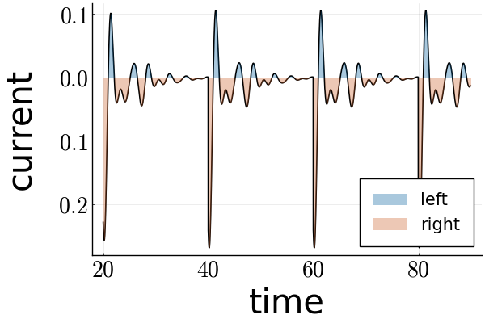

The dynamics and steady-state numerical calculations for a quantum system subject to measurements and dissipation.

The underlying physics and a more detailed description of the protocol can be found in:
Antonic, L., Kafri, Y., Podolsky, D., & Turner, A. M. (2024). Motion from Measurement: The Role of Symmetry of Quantum Measurements. arXiv preprint arXiv:2405.05946.

The module QuantumTrajectories.jl calculates the dynamics of a lattice model subject to measurements of an arbitrary observable defined on non-overlapping bonds. 

*Figure 1*: Current of a measured particle as a function of time.

The measurements cause the system to reach an infinite-temperature state, and therefore, we additionally couple it to a thermal bath. The module QuantumMaster.jl uses the Lindblad quantum master equation to find the steady state of such a system.

*Figure 2*: The steady state Hamiltonian current of a quantum system as a function of the bond observable represented on the Bloch sphere.

The SpinMeasurements.jl module contains the plots of the analytic solution to the same problem, but for a single spin. 

*Figure 3*: Entropy of a spin as a function of time between measurements. The parameter shown in the legend describes the efficiency of the weak measurement.
